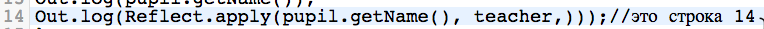

# web05122017
упражнение на исправление ошибок

Форкните борд https://kodaktor.ru/e63c1fb

Исправьте три ошибки в строке 14, связанные со скобками.

В 8-й строке сразу после открывающего тэга ≺pre class="task"> вставьте заголовок h4 с указанием автора решения по алгоритму, указанному в https://kodaktor.ru/g/z7a

В *этом* репозитории создайте пулл-реквест, указав свою фамилию и адрес борда, содержащего исправления.
